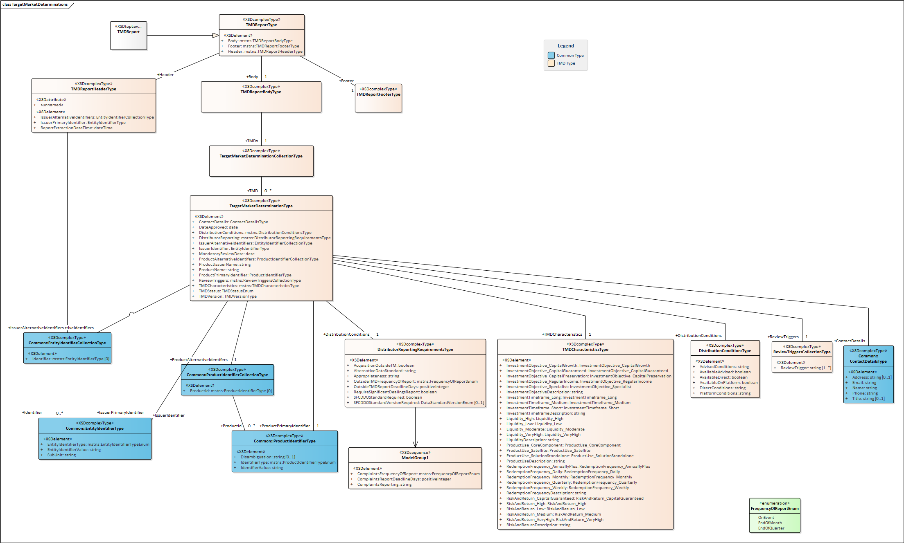

# JSON Format

This folder defines the technical implementation of the FSC DDO Data Standards in an JSON-Schema Representation (see: ).   
 - TMD distribution

 ## Releasing a new version
  - Create a new target branch referencing to the new version
  - increment the version numbers in the schemas
  - complete version consistency checks

 ***
 ## JSON Structure Overview
 ### Target Market Determinations Diagram
 
 