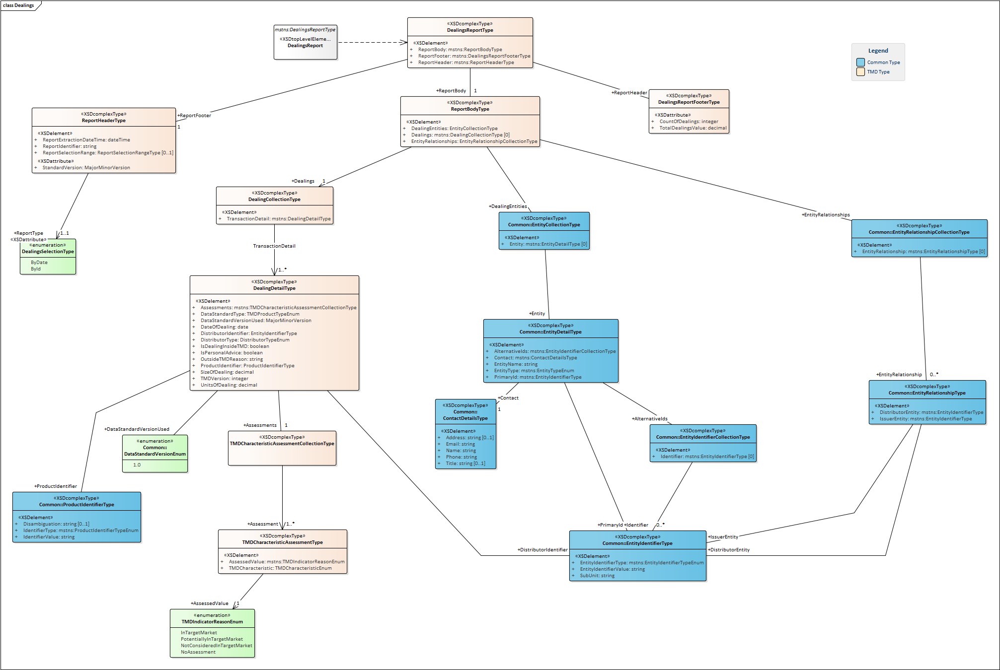

# Xml

This folder defines the technical implementation of the FSC DDO Data Standards in an Xml Representation.   
It consists of three Data Standards
 - TMD distribution
 - Dealings transactions
 - Complaints

 ## Releasing a new version
  - Create a new target branch referencing to the new version
  - increment the version numbers in the schemas
  - Add the new version to the DataStandardVersionEnum in Common.xsd
  - complete version consistency checks (ie the version in all xsd should align to the branch)
  - regenerate all language implementations i.e. the C# code

## Data Standards
 - Suffix all enum types with *Enum
 - Suffix all Global Complex Types with *Type 
 - Suffix all arrays/lists with "*CollectionType"
 - All Collection Types should support a 0-unbounded min/max
 - Only have a single Global element that represents the root element of the report
 - Minimise use of anonymous types

 ***
 ## XSD Structure Overview
 ### Dealings Diagram
 